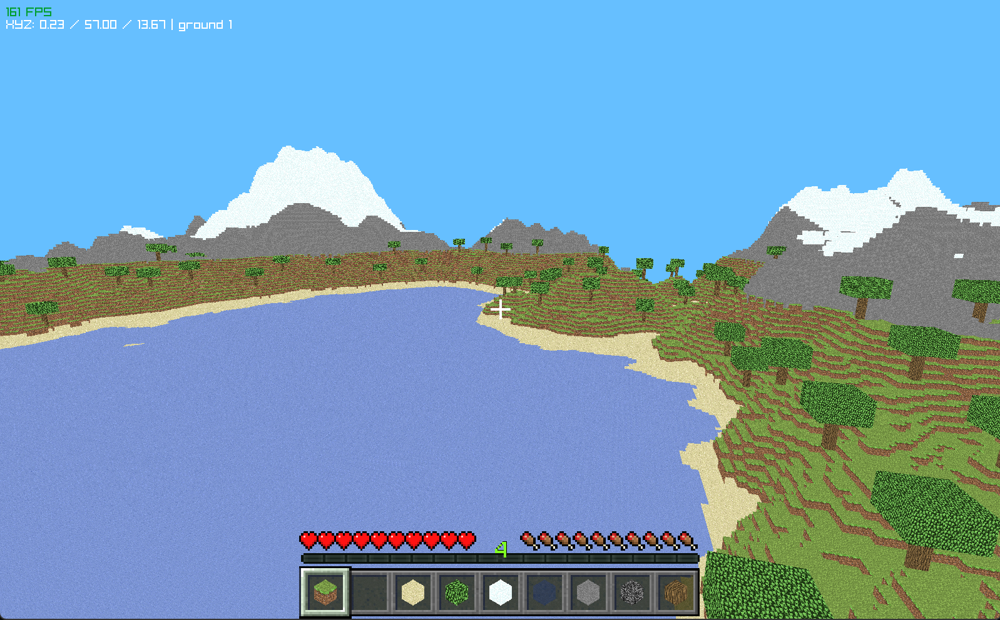

# SAPPHIRE



## Features
- **Optimize rendering:** optimized rendering system to draw only visible blocks and maintain high performance.
- **Chunk generator:** procedural world generation divided into chunks, you can change it by macro.
- **Day/Night cycle:**  dynamic system simulate the movement of sun and moon and relative background color (ex. [sunset](img/Sunset.png)).
- **Default blocks:** standard set of basic blocks, air, sand, dirt, grass, rock, water, snow, badrock, leaf, log, opaque leaf, grass with snow ([texure](texture/atlas/atlas_terrain.png)).
- **Biomes:** generation of six different zone of biomes.
- **Third person:** switch to a third-person camera view in real-time.
- **Custom Skin:** support for loading custom textures for player model.

## Commands
| Action | Key |
|---|---|
| Move | `W`, `A`, `S`, `D` |
| Run / fly faster | `Ctrl` |
| Look around | Mouse |
| Place / remove block | Left / Right click |
| Toggle flight | `F` |
| Fly up / down | `Space` / `Shift` |
| Third person | `V` |
| Debug info | `F3` |
| Body visualization | `F1` |

## Dependencies
Before compiling it, ensure you have the following tools installed on your system:
- **C Compiler:**  is required a standard C compiler like `gcc`.
- **Raylib:** the project is build on [raylib](https://github.com/raysan5/raylib) for graphic and input.

## How to compile

### Windows
```
gcc -o sapphire.exe sapphire.c -lraylib -lgdi32 -lwinmm
.\sapphire.exe
```

### Linux

```bash
gcc -o sapphire sapphire.c -lraylib -lGL -lm -lpthread -ldl -lrt -lX11
./sapphire
```

### MacOS

```bash
gcc -o sapphire  sapphire.c -lraylib -framework OpenGL -framework Cocoa -framework IOKit
./sapphire
```
