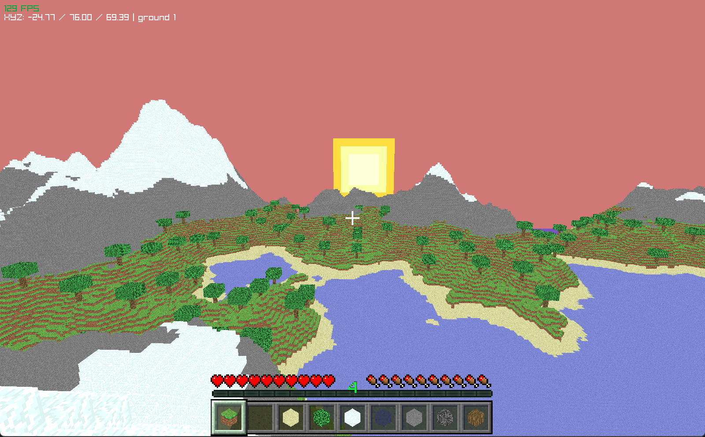

# SAPPHIRE



### Windows run/compile
```
gcc -o sapphire.exe sapphire.c -lraylib -lgdi32 -lwinmm
```
```
.\sapphire.exe
```

### Linux run/compile

```bash
gcc -o sapphire sapphire.c -lraylib -lGL -lm -lpthread -ldl -lrt -lX11
```
```
./sapphire
```

### MacOS run/compile

```bash
gcc -o sapphire  sapphire.c -lraylib -framework OpenGL -framework Cocoa -framework IOKit
```
```
./sapphire
```
